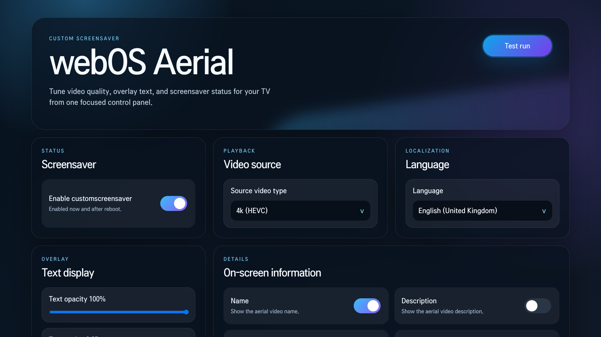

<div align="center">

<br><h1>Aerial webOS screensaver (fork of <a href="https://github.com/aabytt/custom-screensaver-aerial">custom-screensaver-aerial</a>)</h1>
   
<a href="https://github.com/rchalaaa/custom-screensaver/releases/latest"></a>

</div>

## About This Fork

This fork is a complete remake of **custom-screensaver-aerial** originally created by aabytt.

It focuses mainly on improving the overall user experience and application customization, featuring a fully redesigned modern user interface that makes settings easier to find and configure.

Several confusing options from the original project, such as temporary apply modes, have been removed to simplify the experience. Now there is only one straightforward option to enable or disable the screensaver.

### Improvements & Features

- Completely redesigned modern UI
- Simplified configuration experience
- Automatic language synchronization between the app and settings
- Individual toggles for on-screen information:
  - Video title
  - Description
  - Time
  - Date
- Adjustable text scaling for better content fitting
- Multiple built-in fonts included
- Support for custom user-installed fonts
- Enhanced customization options throughout the application

The goal of this fork is to provide a cleaner, simpler, and more customizable experience while preserving the beauty of the original Aerial screensaver project.

## Features from aabytt/custom-screensaver-aerial

- [190+ aerial videos](https://aabytt.github.io/aerial-preview/) from different sources.
- 40+ locales for OSD
- Source type selection (FullHD/4k SDR or Dolby Vision)
- Requires root and Homebrew channel
- Launch screensaver immediately for testing

## Disclaimer

- App replaces original webOS screensaver. Use at your own risk.
- Requires root and Homebrew channel
- Compatible with webOS 5 (2020), webOS 6 (2021), webOS 22 (2022), webOS 23 (2023)

## How to install

### Method 1, using webos dev manager:

1. Download the ipk file from the releases.
2. Download [webos-dev-manager](https://github.com/webosbrew/dev-manager-desktop), and open it
3. Press add device
4. Fill in your TVs information, Authentication Method should be `password`, Username should be `root`, and password should be `alpine`. The host address is the IP address of the TV.
5. In the `Apps` menu, click the Install button in the upper right corner.
6. Choose the ipk file you downloaded earlier.
7. The app should now be installed and should show up in the list. Press Launch to launch it

### Method 2, using the webos CLI:

1. Download the ipk file from the releases.
2. Install the [webos CLI](https://webostv.developer.lge.com/develop/tools/cli-installation)
3. Run the following command with the CLI, but with the IP address of your tv, and a device name: `ares-setup-device --add deviceName -i "host=ip_address" -i "port=22" -i "username=root" -i "password=alpine"`
   For example: `ares-setup-device --add livingRoomTV -i "host=192.168.1.129" -i "port=22" -i "username=root" -i "password=alpine"`
4. Run this command, with the path of the ipk file, to install it. `ares-install --device deviceName /path/to/file.ipk`
5. The app should now be installed. Run `ares-launch --device deviceName org.webosbrew.inputhook` to launch it.

## How to build

1. Clone the repository
2. Run the following commands (assuming PNPM is installed):

```
pnpm install
pnpm run build
pnpm run package
```

3. This will produce an ipk file. See the instructions above for installing it.

## Screenshots




## Credits

https://github.com/aabytt/custom-screensaver-aerial - Original fork, from where the app was refactorized
